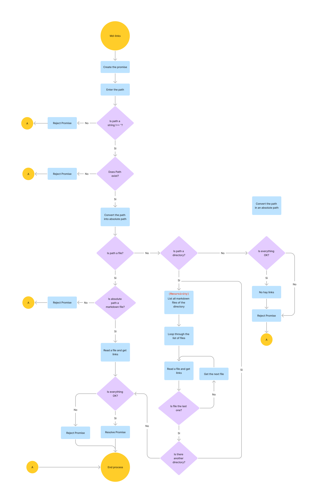

<h1 align="center">
   <b>md-links</b>
</h1>

<p align="center">Promise for searching links into markdown files or directories that contains markdown files.</p>
<br>

## Table of Contents

  - [Installing](#installing)
    - [Package manager](#package-manager)
  - [How to use it](#how-to-use-it)
    - [Using Nodejs](#using-nodejs)
    - [Using the CLI](#using-the-cli)
  - [Documentation](#documentation)
    - [Flow diagram](#flow-diagram)


## Installing

### Package manager

Using npm (In process):

```bash
$ npm install @karolans25/mdlinks
```

<!-- Using bower:

```bash
$ bower install @karolans25/mdlinks
``` -->

<!-- Using yarn:

```bash
$ yarn add @karolans25/mdlinks
``` -->

## How to Use it

Firstable check that you have `Node.js` previously installed in version `>=16`.
```bash
$ node -v
v18.16.1
```

Then you can clone the project repository and install the dependencies

```bash
$ git clone https://github.com/karolans25/DEV010-md-links.git
$ cd DEV010-md-links.git
$ npm install
```

Now you can start to use the library.

### Using Node.js

For using `Node.js` it's neccessary to uncomment the lines of file `index.js` to define the const for the path and invocate the function. These are some examples of path and three ways to invocate the function (without second parameter (optional), with the second parameter equal to `false` or equal to `true`):

```JavaScript
// const thePath = 200;
// const thePath = null;
// const thePath = './REA';
// const thePath = './README.md';
// const thePath = './examples/grandma/example';
// const thePath = './examples/grandma/example1.txt';
const thePath = './examples/';

mdlinks(thePath, true)
  .then((res) => console.log(res, res.length))
  .catch((err) => console.log(err.message));
// mdlinks(thePath, false)
//   .then((res) => console.log(res, res.length))
//   .catch((err) => console.log(err.message));
// mdlinks(thePath)
//   .then((res) => console.log(res, res.length))
//   .catch((err) => console.log(err.message));
```

After that, you can test the library with `node` and write the next command in the bash:

```bash
$ node index.js
```

### Using the CLI

For using the command `mdlinks` you can use the options for check the posibilites. 
```bash
$ mdllinks -h

Usage: mdlinks <./path/file/or/dir> [options]

Options:
  -V, --validate  Validate the links              [boolean]
  -s, --stats     Show the stadistics             [boolean]
  -h, --help      Show help                       [boolean]
  -v, --version   Show version number             [boolean]
```

The default use if without options, here an example directory named `examples`:
```bash
$ mdllinks ./examples
```

Using the option `--validate` for validate the urls and check the status code of the htttp query:
```bash
$ mdllinks ./examples -V
```

Using the option `--stats` for get stadistics for how many links were found and how many are unique:
```bash
$ mdllinks ./examples -s
```

Using both, `--validate` and `--stats` options for get stadistics and check how many links are broken:
```bash
$ mdllinks ./examples -sV
```

An extra option is to know the library version: 
```bash
$ mdllinks -v
v0.1.1
```

## Documentation

### Flow Diagram

<br>

<br>
